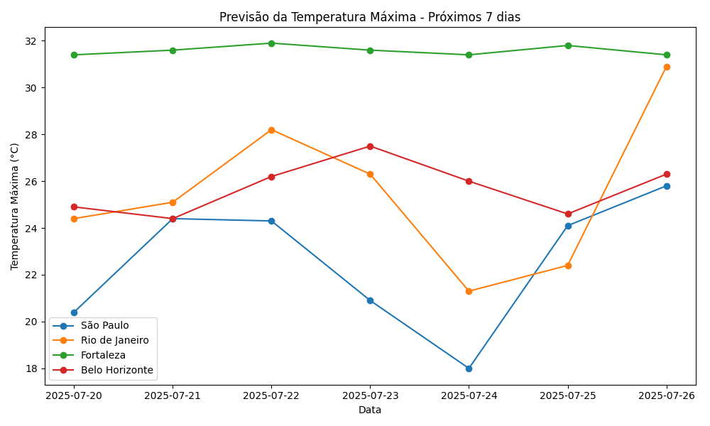

# 🌡️ Previsão de Temperatura Máxima com Open-Meteo

Este projeto utiliza a **API pública da Open-Meteo** para coletar a previsão da **temperatura máxima diária** nos próximos 7 dias em **quatro capitais brasileiras**:  
**São Paulo, Rio de Janeiro, Belo Horizonte e Fortaleza**.

O objetivo é demonstrar como consumir uma API REST real, transformar os dados com Python e visualizá-los com um gráfico de linha comparativo.

---

## 🚀 Tecnologias Utilizadas

- **Python 3.8+**
- `requests` – para chamadas HTTP
- `pandas` – para manipulação dos dados
- `matplotlib` – para visualização

---

## 🧠 Conceitos Aplicados

- Consumo de API pública RESTful
- Manipulação de dados em série temporal
- Merge e análise de múltiplos DataFrames
- Visualização comparativa entre cidades

---

## 🌍 Fonte dos Dados

**[Open-Meteo API](https://open-meteo.com/)**  
API pública gratuita que fornece previsão meteorológica por coordenadas geográficas. Não exige autenticação.

Exemplo de requisição usada:
```
https://api.open-meteo.com/v1/forecast?latitude=-23.55&longitude=-46.63&daily=temperature_2m_max&start_date=2024-01-01&end_date=2024-01-07&timezone=America/Sao_Paulo
```

 O que essa URL pede à API:  
latitude={lat} → localização da cidade  

longitude={lon} → idem  

daily=temperature_2m_max → queremos a temperatura máxima diária  

start_date=... e end_date=... → período de previsão (por exemplo, de hoje até daqui 7 dias)  

timezone=America/Sao_Paulo → para garantir que os horários fiquem no fuso do Brasil  

---

## 🛠️ Como Executar

1. Clone o repositório    

2. Instale as dependências:
   ```bash
   pip install -r requirements.txt
   ```

3. Execute o script:
   ```bash
   python meteo.py
   ```

4. O gráfico será gerado e salvo como:
   ```
   previsao_temperatura.png
   ```

---

## 📊 Exemplo de Saída



---

## 📌 Observações

- Os dados são dinâmicos e mudam todos os dias, já que se referem à **previsão futura**.
- Você pode adaptar o código para outras cidades, basta trocar as coordenadas no dicionário `cidades`.

---

## 💡 Possíveis Extensões

- Adicionar mais cidades
- Analisar variações entre mínima e máxima
- Armazenar os dados em banco de dados ou Parquet
- Automatizar a coleta diária com agendamento (cron ou Airflow)

---

## 🧑‍💻 Autor

Projeto criado por **[Weillon Mota]**  
📫 [weillonmota@gmail.com]  
🔗 [linkedin.com/in/weillonmota](https://linkedin.com/in/weillonmota)

---
