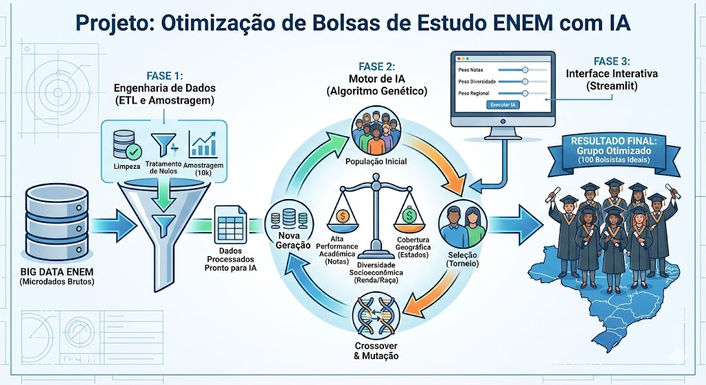

# 🎓 Projeto: Otimização de Bolsas de Estudo ENEM com IA

## 🎯 Visão Geral do Projeto

Este projeto visa solucionar um problema complexo de alocação de recursos para uma fundação educacional privada. O objetivo é selecionar um grupo ideal de **100 bolsistas** a partir dos microdados do ENEM, maximizando o impacto social e acadêmico.

Diferente de uma seleção tradicional baseada apenas em notas, aqui utilizamos **Inteligência Artificial (Algoritmos Genéticos)** para encontrar o equilíbrio matemático ótimo entre três critérios conflitantes:

1.  **Alta Performance Acadêmica** (Médias das notas).
    
2.  **Diversidade Socioeconômica** (Renda, Escola e Raça).
    
3.  **Cobertura Geográfica** (Distribuição pelos estados do Brasil).


    

----------

## 🛠️ Fase 1: Engenharia de Dados (ETL e Amostragem)

Antes de aplicar a inteligência artificial, foi necessário construir um pipeline de dados robusto para tratar os microdados do ENEM (que originalmente possuem gigabytes de tamanho).

### 1. Ingestão e Limpeza (`preparar_dados.py`)

O script de preparação atua como um funil de qualidade.

-   **Leitura Otimizada:** Em vez de carregar o dataset inteiro, filtramos apenas as colunas de interesse (`NU_NOTA_...`, `TP_ESCOLA`, `Q006`, etc.), economizando memória RAM.
    
-   **Tratamento de Nulos:** Aplicamos uma regra de negócio rigorosa: candidatos que faltaram em qualquer prova (nota vazia) são removidos, pois o critério de "alto potencial" exige todas as notas.
    
-   **Amostragem Estratégica:** Para garantir a performance do algoritmo genético em tempo hábil, geramos uma amostragem aleatória e representativa de 10.000 candidatos.
    

#### 💻 Código de Preparação

O script abaixo carrega os dados brutos, trata o encoding (Latin-1) e exporta a base processada pronta para o algoritmo.

Python

```
import pandas as pd
import numpy as np
import os
from typing import List

def processar_dados_enem(caminho_arquivo: str, tamanho_amostra: int = 10000) -> None:
    # 1. Definição das colunas
    colunas_leitura: List[str] = [
        'NU_INSCRICAO', 
        'NU_NOTA_MT', 'NU_NOTA_CN', 'NU_NOTA_LC', 'NU_NOTA_CH', 'NU_NOTA_REDACAO',
        'Q006', 'Q002', 'TP_ESCOLA', 'TP_COR_RACA',
        'SG_UF_PROVA'  # Usada como proxy para residência
    ]

    print(f"Iniciando leitura do arquivo: {caminho_arquivo}")
    
    try:
        # Lê o arquivo original (que usa ; e latin1)
        df = pd.read_csv(caminho_arquivo, sep=';', encoding='latin1', usecols=colunas_leitura)
    except ValueError as e:
        print(f"ERRO NA LEITURA: {e}")
        return

    # Renomear para o padrão do projeto
    df.rename(columns={'SG_UF_PROVA': 'SG_UF_RESIDENCIA'}, inplace=True)
    
    # 2. Limpeza (Remover quem não tem nota)
    colunas_notas = ['NU_NOTA_MT', 'NU_NOTA_CN', 'NU_NOTA_LC', 'NU_NOTA_CH', 'NU_NOTA_REDACAO']
    df_limpo = df.dropna(subset=colunas_notas).copy()

    # 3. Amostragem Aleatória
    if len(df_limpo) > tamanho_amostra:
        df_final = df_limpo.sample(n=tamanho_amostra, random_state=42)
    else:
        df_final = df_limpo

    # 4. Salvar com separador PONTO E VÍRGULA
    diretorio_atual = os.path.dirname(os.path.abspath(__file__))
    output_file = os.path.join(diretorio_atual, 'dados_enem_processados.csv')
    
    df_final.to_csv(output_file, index=False, sep=';')
    print(f"Sucesso! Arquivo gerado em: {output_file}")

```

----------

## 🧬 Fase 2: O Motor de Inteligência Artificial (Algoritmo Genético)

Esta é a camada "Gold" do projeto. Implementamos um algoritmo evolutivo inspirado na seleção natural de Darwin. O sistema cria populações de soluções, cruza os melhores candidatos e aplica mutações para fugir de máximos locais.

### Conceitos Implementados

-   **Cromossomo:** Uma lista contendo 100 IDs únicos de candidatos (representando um grupo de bolsistas).
    
-   **Fitness (Aptidão):** Uma função matemática que avalia a qualidade do grupo baseada nos pesos definidos (Ex: 50% Nota, 30% Diversidade, 20% Região).
    
-   **Operadores Genéticos:**
    
    -   _Torneio:_ Seleciona os melhores "pais" para reprodução.
        
    -   _Crossover (80%):_ Combina metade de um grupo com metade de outro.
        
    -   _Mutação (5%):_ Troca aleatoriamente um aluno do grupo para introduzir variabilidade genética.
        

#### 💻 Código do Algoritmo (`algoritmo_genetico.py`)

Abaixo, a classe principal que gerencia o ciclo evolutivo.

Python

```
import pandas as pd
import numpy as np
import random
import os
import matplotlib.pyplot as plt
import seaborn as sns
from typing import List, Tuple, Dict, Optional

# --- CONFIGURACOES DO PROJETO ---
TAMANHO_GRUPO = 100        
TAMANHO_POPULACAO = 20     
GERACOES = 100             
TAXA_MUTACAO = 0.05        
TAXA_CROSSOVER = 0.8       

class OtimizadorBolsas:
    def __init__(self, caminho_dados: str, pesos: Optional[Dict[str, float]] = None):
        """
        Inicializa o otimizador.
        :param pesos: Dicionario com chaves 'notas', 'diversidade', 'regional'. 
                      
        """
        # Define pesos padrao se nao forem passados
        if pesos is None:
            self.pesos = {'notas': 0.5, 'diversidade': 0.3, 'regional': 0.2}
        else:
            self.pesos = pesos

        # Leitura com ponto e virgula
        self.df = pd.read_csv(caminho_dados, sep=';', encoding='latin1')
        self.indices_disponiveis = self.df.index.tolist()
        self.max_nota = 1000 
        print(f"Dados carregados. Pesos: {self.pesos}")

    def calcular_fitness(self, cromossomo: List[int]) -> float:
        grupo = self.df.iloc[cromossomo]

        # 1. Performance Academica
        cols_notas = ['NU_NOTA_MT', 'NU_NOTA_CN', 'NU_NOTA_LC', 'NU_NOTA_CH', 'NU_NOTA_REDACAO']
        media_grupo = grupo[cols_notas].mean().mean()
        score_notas = media_grupo / self.max_nota

        # 2. Diversidade Socioeconomica
        div_renda = len(grupo['Q006'].unique()) / len(self.df['Q006'].unique())
        div_escola = len(grupo['TP_ESCOLA'].unique()) / len(self.df['TP_ESCOLA'].unique())
        div_raca = len(grupo['TP_COR_RACA'].unique()) / len(self.df['TP_COR_RACA'].unique())
        score_diversidade = (div_renda + div_escola + div_raca) / 3

        # 3. Cobertura Regional
        qtd_estados = len(grupo['SG_UF_RESIDENCIA'].unique())
        total_estados = 27
        score_regional = qtd_estados / total_estados

        # Formula Final usando os PESOS DINAMICOS
        fitness = (self.pesos['notas'] * score_notas) + \
                  (self.pesos['diversidade'] * score_diversidade) + \
                  (self.pesos['regional'] * score_regional)
        return fitness

    def gerar_individuo(self) -> List[int]:
        return random.sample(self.indices_disponiveis, TAMANHO_GRUPO)

    def crossover(self, pai1: List[int], pai2: List[int]) -> Tuple[List[int], List[int]]:
        ponto = random.randint(1, TAMANHO_GRUPO - 1)
        filho1 = pai1[:ponto] + pai2[ponto:]
        filho2 = pai2[:ponto] + pai1[ponto:]
        return self.reparar(filho1), self.reparar(filho2)

    def reparar(self, cromossomo: List[int]) -> List[int]:
        unico = list(set(cromossomo))
        faltam = TAMANHO_GRUPO - len(unico)
        if faltam > 0:
            disponiveis = list(set(self.indices_disponiveis) - set(unico))
            novos = random.sample(disponiveis, faltam)
            unico.extend(novos)
        return unico

    def mutacao(self, cromossomo: List[int]) -> List[int]:
        novo_cromo = cromossomo[:]
        if random.random() < TAXA_MUTACAO:
            idx_troca = random.randint(0, TAMANHO_GRUPO - 1)
            novo_candidato = random.choice(self.indices_disponiveis)
            while novo_candidato in novo_cromo:
                novo_candidato = random.choice(self.indices_disponiveis)
            novo_cromo[idx_troca] = novo_candidato
        return novo_cromo

    def selecionar_torneio(self, populacao, fitnesses):
        competidores = random.sample(list(zip(populacao, fitnesses)), 3)
        return max(competidores, key=lambda x: x[1])[0]

    def executar(self) -> Tuple[List[int], List[float]]:
        # Removidos prints excessivos para nao poluir o Streamlit
        populacao = [self.gerar_individuo() for _ in range(TAMANHO_POPULACAO)]
        melhor_historico = []
        melhor_solucao_global = None
        melhor_fit_global = -1.0

        for _ in range(GERACOES):
            fitnesses = [self.calcular_fitness(ind) for ind in populacao]
            
            max_fit_atual = max(fitnesses)
            idx_max = fitnesses.index(max_fit_atual)
            
            if max_fit_atual > melhor_fit_global:
                melhor_fit_global = max_fit_atual
                melhor_solucao_global = populacao[idx_max]

            melhor_historico.append(max_fit_atual)

            nova_pop = [melhor_solucao_global]
            while len(nova_pop) < TAMANHO_POPULACAO:
                pai1 = self.selecionar_torneio(populacao, fitnesses)
                pai2 = self.selecionar_torneio(populacao, fitnesses)
                if random.random() < TAXA_CROSSOVER:
                    f1, f2 = self.crossover(pai1, pai2)
                else:
                    f1, f2 = pai1, pai2
                nova_pop.append(self.mutacao(f1))
                if len(nova_pop) < TAMANHO_POPULACAO:
                    nova_pop.append(self.mutacao(f2))
            populacao = nova_pop

        return melhor_solucao_global, melhor_historico

if __name__ == "__main__":
    # Mantem funcionamento original via terminal
    diretorio_atual = os.path.dirname(os.path.abspath(__file__))
    arquivo_dados = os.path.join(diretorio_atual, 'dados_enem_processados.csv')

    if os.path.exists(arquivo_dados):
        print("Rodando modo padrao (Terminal)...")
        ga = OtimizadorBolsas(arquivo_dados) # Usa pesos padrao
        melhor_grupo, historico = ga.executar()
        
        # Salva CSV
        df_resultado = ga.df.iloc[melhor_grupo]
        caminho_resultado = os.path.join(diretorio_atual, 'resultado_grupo_ideal.csv')
        df_resultado.to_csv(caminho_resultado, index=False, sep=';')
        print(f"Sucesso! Salvo em {caminho_resultado}")
        
        # Gera Grafico
        plt.figure(figsize=(10, 6))
        plt.plot(historico)
        plt.savefig(os.path.join(diretorio_atual, 'grafico_evolucao.png'))
```

----------

## 📲 Fase 3: Interface Interativa (Streamlit)

Para democratizar o acesso à ferramenta e permitir que os gestores da fundação testem diferentes cenários, desenvolvemos uma interface web utilizando **Streamlit**.

### Funcionalidades do Dashboard

-   **Simulação em Tempo Real:** O usuário pode alterar os pesos (Ex: dar 80% de importância para Renda) e re-executar a IA instantaneamente.
    
-   **Visualização de Evolução:** Exibe o gráfico de aprendizado do algoritmo geração a geração.
    
-   **Exportação:** Permite o download da lista final dos 100 selecionados em CSV/Excel.
    

#### 💻 Código da Interface (`app.py`)

Python

```
import streamlit as st
# ... imports ...

# --- SIDEBAR: CONTROLES ---
st.sidebar.header("Critérios de Seleção")
p_notas = st.sidebar.slider("Performance Acadêmica", 0, 100, 50)
p_diversidade = st.sidebar.slider("Diversidade Social", 0, 100, 30)
p_regional = st.sidebar.slider("Cobertura Regional", 0, 100, 20)

if st.sidebar.button("🤖 Encontrar Bolsistas", type="primary"):
    # Normaliza pesos e executa a IA
    pesos_norm = {
        'notas': p_notas / total,
        'diversidade': p_diversidade / total,
        'regional': p_regional / total
    }
    
    with st.spinner('A IA está evoluindo as gerações...'):
        ga = OtimizadorBolsas(arquivo_dados, pesos=pesos_norm)
        melhor_indices, historico = ga.executar()
        
    # Exibe resultados e gráficos...

```

----------

## ✨ Resultados e Insights

A aplicação da IA permitiu sair de uma seleção manual e enviesada para um processo otimizado matematicamente.

### 📈 Evolução do Aprendizado

O gráfico abaixo demonstra a "curva de aprendizado" do algoritmo. Note os degraus (saltos): eles representam momentos onde a **Mutação** ou o **Crossover** encontraram uma combinação genética superior, elevando o "Fitness" do grupo.

### 📊 O Grupo Ideal

Ao final de 100 gerações, o sistema convergiu para um grupo que atende aos critérios complexos:

-   **Notas:** Alta média geral, garantindo meritocracia.
    
-   **Diversidade:** Inclusão de candidatos de rendas baixas (Classes D/E) e de escolas públicas.
    
-   **Geografia:** Representatividade de múltiplos estados, evitando a concentração no eixo Sul-Sudeste.
    

Explore a ferramenta online clicando no link abaixo.

👉 **[Acesse o Dashboard Interativo (Streamlit)](https://projetos-algoritomo-genetico-bolsistas.streamlit.app)**

----------

## 🎥 Vídeo Explicativo

Assista a uma demonstração completa do algoritmo rodando e da análise dos resultados na interface web:

👉 **[Apresentação do Projeto no YouTube](https://youtu.be/xAnRBAN9FcY)**

----------

## 🚀 Tecnologias Utilizadas

-   **Linguagem:** Python 3.10+
    
-   **Interface Web:** Streamlit
    
-   **Manipulação de Dados:** Pandas, NumPy
    
-   **Visualização:** Matplotlib, Seaborn
    
-   **Lógica:** Algoritmos Genéticos (Implementação própria)
    

----------

## 👨‍💻 Autor

**Weillon Mota**

-   [LinkedIn](https://www.linkedin.com/in/weillonmota/)
    
-   [GitHub](https://github.com/weillonmota/projetos)
