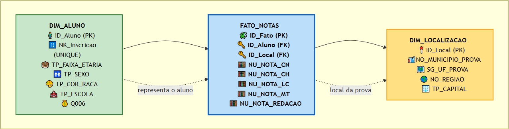
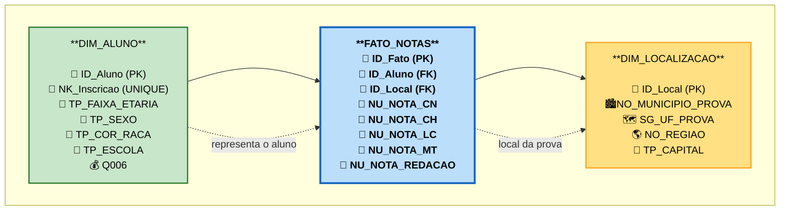
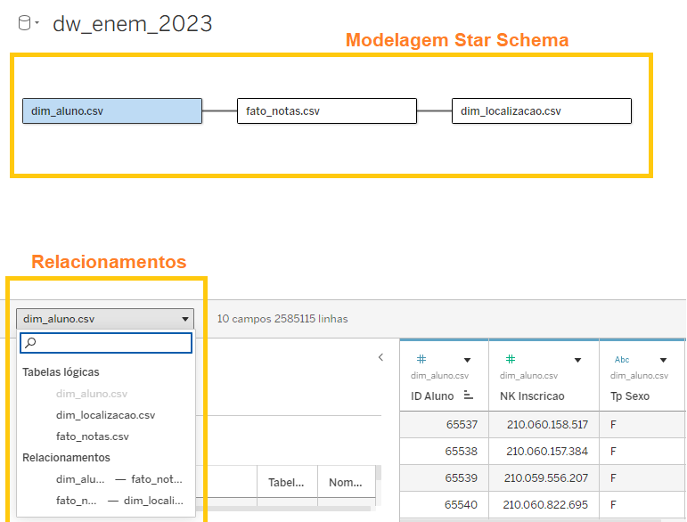
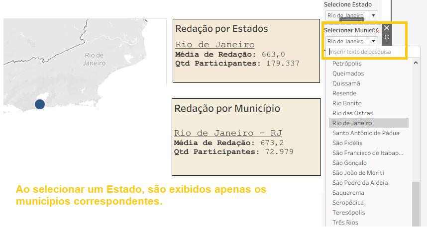
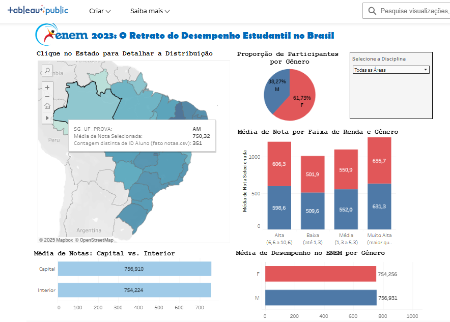
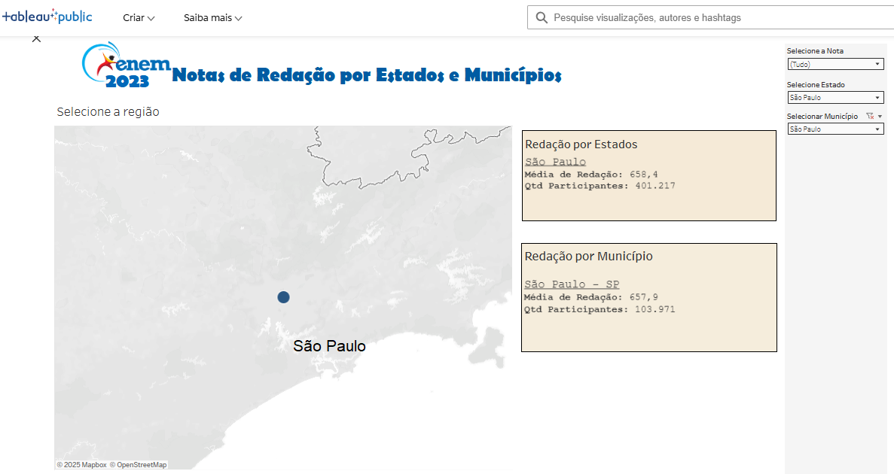

## 🎯 Introdução e Motivação

Este projeto mergulha fundo nos dados do ENEM 2023 para **desvendar padrões de desempenho** dos estudantes. Meu objetivo principal foi criar um **dashboard interativo no Tableau** que permitisse explorar esses dados de diversas formas, tornando a análise mais acessível e visual para qualquer um interessado nos resultados do exame.

Antes mesmo de colocar a mão no código e iniciar o processo de ETL (Extract, Transform, Load), foi essencial um bom **planejamento e organização**. A motivação por trás deste projeto foi clara: responder a algumas perguntas-chave que nos dariam insights sobre o desempenho no ENEM.

### ❓ Questões de Negócio a serem Respondidas pelo Dashboard:

Para guiar nossa análise e garantir que o dashboard fosse útil, definimos as seguintes perguntas:

1.  **Desempenho por Localização:** Qual o desempenho médio dos alunos por Estado e Região?
2.  **Impacto Socioeconômico:** Como o desempenho médio dos alunos varia por faixa socioeconômica?
3.  **Excelência na Redação:** Qual a distribuição das maiores notas de redação por estado e município? Quantos alunos atingem essa nota máxima?
4.  **Distribuição Geográfica de Destaques:** Onde estão concentrados os alunos com as maiores notas por área de conhecimento (Matemática, Linguagens, etc.)?
5.  **Gênero e Contexto Social:** Qual a distribuição das notas por gênero e situação socioeconômica?
6.  **Idade e Performance:** Como as notas se distribuem por faixa etária?
7.  **Diversidade no Desempenho:** Há diferenças na distribuição das notas por raça/cor?
8.  **Capital vs. Interior:** Quais são as diferenças nas médias de notas entre alunos de capitais e do interior?
9.  **Gênero por Área de Conhecimento:** Qual a comparação das notas por gênero em cada área de conhecimento?
10. **Ensino Público vs. Privado:** Qual a média de notas entre alunos de escolas públicas e privadas por área de conhecimento?

Com essas perguntas em mente, conseguimos direcionar a atenção para as colunas exatas necessárias no nosso conjunto de dados, otimizando todas as etapas de importação, limpeza e carregamento.

---

## 🛠️ Processo de ETL (Extract, Transform, Load)

Aqui detalhamos como os dados brutos foram transformados em um formato pronto para análise no Tableau. Utilizamos **Python** com a biblioteca **Pandas** para realizar todas as etapas do ETL.

### **1. Extração - Carregando os Microdados do ENEM 2023**

A primeira etapa foi carregar os microdados do ENEM 2023. Este arquivo possui um volume considerável de informações, então é importante garantir que o caminho do arquivo esteja correto e que as opções de leitura (como encoding e separador) estejam configuradas para evitar erros.

```python
import pandas as pd
import os

nome_do_arquivo = '../dados_brutos/MICRODADOS_ENEM_2023.csv'

# --- DEBUG ---
print(f"O Python está rodando a partir de: {os.getcwd()}")
print(f"Tentando carregar o caminho absoluto: '{nome_do_arquivo}'...")
# -------------

try:
    # Tenta carregar uma amostra para verificar se o arquivo está acessível e as configurações estão corretas.
    # Usamos `nrows=100` para carregar apenas as 100 primeiras linhas, o que é rápido para um teste.
    df_amostra = pd.read_csv(
        nome_do_arquivo, 
        encoding='latin-1', 
        sep=';', 
        nrows=100
    )

    # Se deu certo, mostra as 10 primeiras linhas e a lista completa de colunas encontradas.
    # Isso nos ajuda a confirmar a estrutura do arquivo.
    print("\n--- SUCESSO! ---")
    print("Amostra (10 primeiras linhas):")
    display(df_amostra.head(10)) 

    print("\n--- Lista completa de colunas encontradas: ---")
    print(df_amostra.columns.to_list())

except FileNotFoundError:
    print(f"\nERRO: Arquivo não encontrado!")
    print(f"O caminho '{nome_do_arquivo}' ainda está incorreto.")
    print("Por favor, verifique se o nome do arquivo e das pastas estão idênticos, incluindo maiúsculas/minúsculas.")
except Exception as e:
    print(f"\nERRO ao tentar ler o arquivo: {e}")
```

<details>
<summary>⚡ Clique para expandir a Saída do Código</summary>

```
caminho absoluto: 
'../dados_brutos/MICRODADOS_ENEM_2023.csv'...
--- SUCESSO! ---
Amostra (10 primeiras linhas):
	NU_INSCRICAO	NU_ANO	TP_FAIXA_ETARIA	TP_SEXO	TP_ESTADO_CIVIL	TP_COR_RACA	TP_NACIONALIDADE	TP_ST_CONCLUSAO	TP_ANO_CONCLUIU	TP_ESCOLA	...	Q016	Q017	Q018	Q019	Q020	Q021	Q022	Q023	Q024	Q025
0	210059085136	2023	14	M	2	1	1	1	17	1	...	C	C	B	B	A	B	B	A	A	B
1	210059527735	2023	12	M	2	1	0	1	16	1	...	B	A	B	B	A	A	C	A	D	B
2	210061103945	2023	6	F	1	1	1	1	0	1	...	B	A	A	B	A	A	A	A	A	B
3	210060214087	2023	2	F	1	3	1	2	0	2	...	A	A	A	B	A	A	D	A	A	B
4	210059980948	2023	3	F	1	3	1	2	0	2	...	A	A	A	B	A	A	B	A	A	A
5	210058061539	2023	6	F	1	3	1	1	0	1	...	B	A	A	B	A	A	C	A	A	B
6	210059855122	210059855122	11	F	1	3	1	1	12	1	...	B	A	A	B	A	B	B	A	A	B
7	210058387333	2023	11	M	1	3	1	1	12	1	...	B	A	A	A	A	A	B	A	B	B
8	210059085137	2023	5	F	1	2	1	1	1	1	...	B	A	A	B	A	A	C	A	A	B
9	210060801601	2023	11	M	1	1	1	1	8	1	...	B	A	B	C	B	A	C	A	B	B
10 rows × 76 columns
```

```
--- Lista completa de colunas encontradas: ---
['NU_INSCRICAO', 'NU_ANO', 'TP_FAIXA_ETARIA', 'TP_SEXO', 'TP_ESTADO_CIVIL', 'TP_COR_RACA', 'TP_NACIONALIDADE', 'TP_ST_CONCLUSAO', 'TP_ANO_CONCLUIU', 'TP_ESCOLA', 'TP_ENSINO', 'IN_TREINEIRO', 'CO_MUNICIPIO_ESC', 'NO_MUNICIPIO_ESC', 'CO_UF_ESC', 'SG_UF_ESC', 'TP_DEPENDENCIA_ADM_ESC', 'TP_LOCALIZACAO_ESC', 'TP_SIT_FUNC_ESC', 'CO_MUNICIPIO_PROVA', 'NO_MUNICIPIO_PROVA', 'CO_UF_PROVA', 'SG_UF_PROVA', 'TP_PRESENCA_CN', 'TP_PRESENCA_CH', 'TP_PRESENCA_LC', 'TP_PRESENCA_MT', 'CO_PROVA_CN', 'CO_PROVA_CH', 'CO_PROVA_LC', 'CO_PROVA_MT', 'NU_NOTA_CN', 'NU_NOTA_CH', 'NU_NOTA_LC', 'NU_NOTA_MT', 'TX_RESPOSTAS_CN', 'TX_RESPOSTAS_CH', 'TX_RESPOSTAS_LC', 'TX_RESPOSTAS_MT', 'TP_LINGUA', 'TX_GABARITO_CN', 'TX_GABARITO_CH', 'TX_GABARITO_LC', 'TX_GABARITO_MT', 'TP_STATUS_REDACAO', 'NU_NOTA_COMP1', 'NU_NOTA_COMP2', 'NU_NOTA_COMP3', 'NU_NOTA_COMP4', 'NU_NOTA_COMP5', 'NU_NOTA_REDACAO', 'Q001', 'Q002', 'Q003', 'Q004', 'Q005', 'Q006', 'Q007', 'Q008', 'Q009', 'Q010', 'Q011', 'Q012', 'Q013', 'Q014', 'Q015', 'Q016', 'Q017', 'Q018', 'Q019', 'Q020', 'Q021', 'Q022', 'Q023', 'Q024', 'Q025']
```

</details>

<br>

> 💡 **Lição Aprendida:** A etapa de planejamento é fundamental\! Sem uma guia clara (as perguntas de negócio), não saberíamos quais colunas realmente precisaríamos usar. Dessa forma, direcionamos a atenção justamente para as colunas que respondem às questões que motivam a criação do Dashboard, evitando carregar dados desnecessários.

### **2. Carregamento Otimizado e Seleção de Colunas Essenciais**

Após a verificação inicial, carregamos o dataset completo, mas de forma otimizada. Para isso, selecionamos apenas as colunas que são cruciais para responder às nossas perguntas de negócio. Isso reduz o consumo de memória e acelera o processamento, algo vital para grandes volumes de dados como os do ENEM. É importante notar que usamos `NO_MUNICIPIO_PROVA` e `SG_UF_PROVA` como proxy para a localização de residência, já que as colunas originais de residência não estavam disponíveis.

```python
import time # Para cronometrar o tempo de carga

# Vamos usar a variável 'nome_do_arquivo' da Célula 1
# nome_do_arquivo = '../dados_brutos/MICRODADOS_ENEM_2023.csv' 

# --- 1. DEFINIÇÃO DAS COLUNAS (COM OS NOMES CORRIGIDOS) ---
# Selecionamos apenas as colunas que realmente precisamos para a análise.
colunas_para_carregar = [
    'NU_INSCRICAO',
    'NU_NOTA_CN', 'NU_NOTA_CH', 'NU_NOTA_LC', 'NU_NOTA_MT', 'NU_NOTA_REDACAO',
    'TP_PRESENCA_CN', 'TP_PRESENCA_CH', 'TP_PRESENCA_LC', 'TP_PRESENCA_MT', 'TP_STATUS_REDACAO',
    
    # --- COLUNAS DE LOCALIZAÇÃO ---
    # Usando local da PROVA como substituto para local de RESIDÊNCIA
    'NO_MUNICIPIO_PROVA', 
    'SG_UF_PROVA', 
    
    'TP_SEXO', 'TP_FAIXA_ETARIA', 'TP_COR_RACA',
    'TP_ESCOLA', 'Q006' # Q006 é para renda familiar
]

print(f"Definidas {len(colunas_para_carregar)} colunas para carregar.")
print(f"Iniciando a carga do arquivo: '{nome_do_arquivo}'...")
print("(Isso pode levar alguns minutos...)")

# Medindo o tempo para acompanhar a performance da carga
start_time = time.time()

try:
    # --- 2. CARGA OTIMIZADA ---
    # O `usecols` garante que apenas as colunas especificadas sejam lidas, otimizando a memória.
    df_enem_completo = pd.read_csv(
        nome_do_arquivo, 
        encoding='latin-1', 
        sep=';',
        usecols=colunas_para_carregar # Usando a lista corrigida de colunas
    )
    
    end_time = time.time()
    
    print(f"\n--- SUCESSO! ---")
    print(f"Arquivo completo carregado em {end_time - start_time:.2f} segundos.")
    print("DataFrame 'df_enem_completo' está pronto.")
    
    # --- 3. MOSTRAR OS DADOS ---
    print("\n--- Amostra (5 primeiras linhas dos dados carregados): ---")
    display(df_enem_completo.head())
    
    print("\n--- Informações (Tipos de dados e valores nulos): ---")
    df_enem_completo.info()

except Exception as e:
    print(f"\n--- ERRO DURANTE A CARGA ---")
    print(f"Erro: {e}")
    print("Se o erro persistir, verifique os nomes da lista 'colunas_para_carregar' novamente.")
```

<details>
<summary>⚡ Clique para expandir a Saída do Código</summary>

```
Definidas 18 colunas para carregar.
Iniciando a carga do arquivo: 'C:/Users/Weillon Mota/Documents/Microdados ENEM/dados_brutos/MICRODADOS_ENEM_2023.csv'...
(Isso pode levar alguns minutos...)

--- SUCESSO! ---
Arquivo completo carregado em 23.64 segundos.
DataFrame 'df_enem_completo' está pronto.

--- Amostra (5 primeiras linhas dos dados carregados): ---
```

```
NU_INSCRICAO	TP_FAIXA_ETARIA	TP_SEXO	TP_COR_RACA	TP_ESCOLA	NO_MUNICIPIO_PROVA	SG_UF_PROVA	TP_PRESENCA_CN	TP_PRESENCA_CH	TP_PRESENCA_LC	TP_PRESENCA_MT	NU_NOTA_CN	NU_NOTA_CH	NU_NOTA_LC	NU_NOTA_MT	TP_STATUS_REDACAO	NU_NOTA_REDACAO	Q006
0	210059085136	14	M	1	1	Brasília	DF	0	0	0	0	NaN	NaN	NaN	NaN	NaN	NaN	F
1	2023	12	M	2	1	0	1	16	1	...	B	A	B	B	A	A	C	A	D	B
2	210061103945	6	F	1	1	Caxias do Sul	RS	1	1	1	1	502.0	498.9	475.6	363.2	1.0	700.0	C
3	210060214087	2	F	3	2	Fortaleza	CE	1	1	1	1	459.0	508.5	507.2	466.7	1.0	880.0	C
4	210059980948	3	F	3	2	Quixadá	CE	1	1	1	1	402.5	379.2	446.9	338.3	1.0	560.0	B

```

```
--- Informações (Tipos de dados e valores nulos): ---
<class 'pandas.core.frame.DataFrame'>
RangeIndex: 3933955 entries, 0 to 3933954
Data columns (total 18 columns):
 #   Column              Dtype  
---  ------              -----  
 0   NU_INSCRICAO        int64  
 1   TP_FAIXA_ETARIA     int64  
 2   TP_SEXO             object 
 3   TP_COR_RACA         int64  
 4   TP_ESCOLA           int64  
 5   NO_MUNICIPIO_PROVA  object 
 6   SG_UF_PROVA         object 
 7   TP_PRESENCA_CN      int64  
 8   TP_PRESENCA_CH      int64  
 9   TP_PRESENCA_LC      int64  
 10  TP_PRESENCA_MT      int64  
 11  NU_NOTA_CN          float64
 12  NU_NOTA_CH          float64
 13  NU_NOTA_LC          float64
 14  NU_NOTA_MT          float64
 15  TP_STATUS_REDACAO   float64
 16  NU_NOTA_REDACAO     float64
 17  Q006                object 
dtypes: float64(6), int64(8), object(4)
memory usage: 540.2+ MB
```

</details>

### **3. Limpeza e Filtragem de Dados (Focando em Alunos Válidos)**

Esta etapa é crucial para garantir que nossa análise seja feita apenas com dados de alunos que realmente participaram do exame e tiveram suas redações avaliadas. Filtramos o DataFrame para incluir apenas os candidatos que estiveram presentes em **todas as quatro provas objetivas** e cuja **redação foi válida** (status 1 = "Sem Problemas"). Isso remove `NaN` (valores nulos) das notas, garantindo a integridade dos cálculos.

```python
# --- CÉLULA 4: Limpeza e Transformação (Filtrando Presentes) ---

print("Iniciando a limpeza dos dados...")

# Verificação para garantir que o DataFrame principal foi carregado
if 'df_enem_completo' not in locals():
    print("ERRO: 'df_enem_completo' não foi encontrado.")
    print("Por favor, rode a Célula de carga dos dados primeiro.")
else:
    print(f"Total de inscritos (linhas) no DataFrame original: {len(df_enem_completo)}")

    # 1. Filtrando quem estava PRESENTE em todas as provas
    #    (TP_PRESENCA == 1 significa 'Presente')
    filtro_presenca = (
        (df_enem_completo['TP_PRESENCA_CN'] == 1) &
        (df_enem_completo['TP_PRESENCA_CH'] == 1) &
        (df_enem_completo['TP_PRESENCA_LC'] == 1) &
        (df_enem_completo['TP_PRESENCA_MT'] == 1)
    )

    # 2. Filtrando quem teve a REDAÇÃO VÁLIDA (Status 1 = "Sem Problemas")
    #    Isso elimina notas zero por fuga ao tema, cópia, etc., garantindo que só analisamos redações válidas.
    filtro_redacao = (df_enem_completo['TP_STATUS_REDACAO'] == 1)

    # 3. Criando o novo DataFrame LIMPO
    #    Usamos .copy() para evitar avisos de SettingWithCopyWarning no futuro,
    #    criando uma cópia independente do DataFrame filtrado.
    df_enem_presentes = df_enem_completo[filtro_presenca & filtro_redacao].copy()

    # 4. Verificando o resultado
    total_inscritos = len(df_enem_completo)
    total_presentes = len(df_enem_presentes)
    total_ausentes_ou_eliminados = total_inscritos - total_presentes
    
    print(f"\n--- Resumo da Limpeza ---")
    print(f"Total de alunos PRESENTES em todas as provas e com redação válida: {total_presentes}")
    print(f"Total de alunos AUSENTES ou eliminados pelos filtros: {total_ausentes_ou_eliminados}")

    print("\n--- Amostra do DataFrame limpo (`df_enem_presentes.head()`): ---")
    # Agora, não devem mais existir 'NaN' nas colunas de notas para esses alunos.
    display(df_enem_presentes.head())

    print("\n--- Verificando valores nulos nas notas (DEPOIS da limpeza): ---")
    # Confirmamos que as colunas de notas não possuem mais valores nulos, como esperado.
    print(df_enem_presentes[['NU_NOTA_CN', 'NU_NOTA_CH', 'NU_NOTA_LC', 'NU_NOTA_MT', 'NU_NOTA_REDACAO']].isnull().sum())
```

<details>
<summary>⚡ Clique para expandir a Saída do Código</summary>

```
Iniciando a limpeza dos dados...
Total de inscritos (linhas) no DataFrame original: 3933955

--- Resposta à Pergunta 11 ---
Total de alunos PRESENTES e com redação válida: 2585115
Total de alunos AUSENTES ou eliminados: 1348840

--- Amostra do DataFrame limpo (df_enem_presentes.head()): ---
```

```
	NU_INSCRICAO	TP_FAIXA_ETARIA	TP_SEXO	TP_COR_RACA	TP_ESCOLA	NO_MUNICIPIO_PROVA	SG_UF_PROVA	TP_PRESENCA_CN	TP_PRESENCA_CH	TP_PRESENCA_LC	TP_PRESENCA_MT	NU_NOTA_CN	NU_NOTA_CH	NU_NOTA_LC	NU_NOTA_MT	TP_STATUS_REDACAO	NU_NOTA_REDACAO	Q006
2	210061103945	6	F	1	1	Caxias do Sul	RS	1	1	1	1	502.0	498.9	475.6	363.2	1.0	700.0	C
3	210060214087	2	F	3	2	Fortaleza	CE	1	1	1	1	459.0	508.5	507.2	466.7	1.0	880.0	C
4	210059980948	3	F	3	2	Quixadá	CE	1	1	1	1	402.5	379.2	446.9	338.3	1.0	560.0	B
9	210060801601	11	M	1	1	Batatais	SP	1	1	1	1	564.7	630.3	610.4	680.2	1.0	600.0	F
10	210059085130	8	M	3	1	Natal	RN	1	1	1	1	644.9	620.2	626.9	736.3	1.0	860.0	B

```

```
--- Verificando valores nulos nas notas (DEPOIS da limpeza): ---
NU_NOTA_CN           0
NU_NOTA_CH           0
NU_NOTA_LC           0
NU_NOTA_MT           0
NU_NOTA_REDACAO      0
dtype: int64
```

</details>

### **4. Enriquecimento Geográfico - Regiões e Capitais**

Para responder às perguntas sobre desempenho por região e a diferença entre capitais e interior, enriquecemos o DataFrame com novas colunas. Mapeamos cada UF para sua respectiva Região (Norte, Nordeste, etc.) e classificamos os municípios como "Capital" ou "Interior".

```python
# --- CÉLULA 5: Transformação (Enriquecimento Geográfico) ---

print("Iniciando a Etapa de Transformação (T)...")
print("Criando colunas 'NO_REGIAO' (para a Pergunta 1) e 'TP_CAPITAL' (para a Pergunta 8).")

# 1. Dicionário de Mapeamento de Estados (UF) para Regiões
#    Usamos um dicionário para "traduzir" as siglas dos estados para suas regiões correspondentes.
mapa_regioes = {
    'AC': 'Norte', 'AP': 'Norte', 'AM': 'Norte', 'PA': 'Norte', 'RO': 'Norte', 'RR': 'Norte', 'TO': 'Norte',
    'AL': 'Nordeste', 'BA': 'Nordeste', 'CE': 'Nordeste', 'MA': 'Nordeste', 'PB': 'Nordeste', 'PE': 'Nordeste', 'PI': 'Nordeste', 'RN': 'Nordeste', 'SE': 'Nordeste',
    'DF': 'Centro-Oeste', 'GO': 'Centro-Oeste', 'MT': 'Centro-Oeste', 'MS': 'Centro-Oeste',
    'ES': 'Sudeste', 'MG': 'Sudeste', 'RJ': 'Sudeste', 'SP': 'Sudeste',
    'PR': 'Sul', 'RS': 'Sul', 'SC': 'Sul'
}

# 2. Lista de Capitais Brasileiras
#    Esta lista é usada para identificar se um município é uma capital ou não.
#    Atenção aos acentos! Eles devem bater exatamente com os nomes dos municípios nos dados.
lista_capitais = [
    'Rio Branco', 'Maceió', 'Macapá', 'Manaus', 'Salvador', 'Fortaleza', 'Brasília', 'Vitória', 'Goiânia', 
    'São Luís', 'Cuiabá', 'Campo Grande', 'Belo Horizonte', 'Belém', 'João Pessoa', 'Curitiba', 'Recife', 
    'Teresina', 'Rio de Janeiro', 'Natal', 'Porto Alegre', 'Porto Velho', 'Boa Vista', 'Florianópolis', 
    'São Paulo', 'Aracaju', 'Palmas'
]

try:
    # --- Criando a coluna NO_REGIAO (Pergunta 1) ---
    # O método `.map()` é eficiente para aplicar o dicionário de regiões à coluna de UF.
    df_enem_presentes['NO_REGIAO'] = df_enem_presentes['SG_UF_PROVA'].map(mapa_regioes)
    
    # --- Criando a coluna TP_CAPITAL (Pergunta 8) ---
    # Usamos uma função lambda com `.apply()` para verificar se cada município está na lista de capitais.
    df_enem_presentes['TP_CAPITAL'] = df_enem_presentes['NO_MUNICIPIO_PROVA'].apply(
        lambda municipio: 'Capital' if municipio in lista_capitais else 'Interior'
    )

    print("\n--- SUCESSO! Colunas 'NO_REGIAO' e 'TP_CAPITAL' criadas. ---")
    
    # --- Verificação ---
    print("\nAmostra dos dados com as novas colunas:")
    # Exibimos as colunas relevantes para confirmar que as novas colunas foram criadas corretamente.
    display(df_enem_presentes[['SG_UF_PROVA', 'NO_REGIAO', 'NO_MUNICIPIO_PROVA', 'TP_CAPITAL']].head())
    
    print("\nContagem de alunos por Região (verificando 'NO_REGIAO'):")
    print(df_enem_presentes['NO_REGIAO'].value_counts())
    
    print("\nContagem de alunos por Capital/Interior (verificando 'TP_CAPITAL'):")
    print(df_enem_presentes['TP_CAPITAL'].value_counts())

except Exception as e:
    print(f"\nERRO ao tentar criar as colunas de localização: {e}")
    print("Verifique se o DataFrame 'df_enem_presentes' existe.")
```

<details>
<summary>⚡ Clique para expandir a Saída do Código</summary>

```
Iniciando a Etapa de Transformação (T)...
Criando colunas 'NO_REGIAO' (Pergunta 1) e 'TP_CAPITAL' (Pergunta 8).

--- SUCESSO! Colunas 'NO_REGIAO' e 'TP_CAPITAL' criadas. ---

Amostra dos dados com as novas colunas:
```

```
	SG_UF_PROVA	NO_REGIAO	NO_MUNICIPIO_PROVA	TP_CAPITAL
2	RS	Sul	Caxias do Sul	Interior
3	CE	Nordeste	Fortaleza	Capital
4	CE	Nordeste	Quixadá	Interior
9	SP	Sudeste	Batatais	Interior
10	RN	Nordeste	Natal	Capital
```

```
Contagem de alunos por Região (verificando 'NO_REGIAO'):
NO_REGIAO
Nordeste      948078
Sudeste       872372
Sul           281242
Norte         271389
Centro-Oeste  212034
Name: count, dtype: int64

Contagem de alunos por Capital/Interior (verificando 'TP_CAPITAL'):
TP_CAPITAL
Interior    1837010
Capital      748105
Name: count, dtype: int64
```

</details>

---

## 🏗️ Modelagem de Dados - Star Schema

Para otimizar a performance das consultas no Tableau e organizar os dados de forma lógica, aplicamos a modelagem de dados **Star Schema (Esquema em Estrela)**. Esta é uma técnica comum em Data Warehouses, onde temos uma tabela central de **Fatos** (com métricas e chaves estrangeiras) e várias tabelas de **Dimensão** (com atributos descritivos) conectadas a ela.

### **Vantagens do Star Schema:**

* **Simplicidade:** Fácil de entender e navegar.
* **Performance:** Consultas mais rápidas, especialmente para ferramentas de BI como o Tableau.
* **Flexibilidade:** Permite adicionar novas dimensões e fatos facilmente.

Neste projeto, criamos as seguintes tabelas:
* **`fato_notas`**: A tabela central com as notas e chaves para as dimensões.
* **`dim_aluno`**: Contém informações sobre os alunos.
* **`dim_localizacao`**: Contém detalhes sobre a localização (estado, município, região, capital/interior).

Vamos focar na criação da `fato_notas`, pois as `dim_aluno` e `dim_localizacao` seriam criadas a partir de transformações do `df_enem_presentes` (com a separação de atributos únicos para cada dimensão e a geração de IDs substitutas).



<details>
<summary>⚡ Clique para expandir a Modelagem em Mermaid</summary>



</details>


### **Criação da Tabela `fato_notas`**

A `fato_notas` é o coração do nosso modelo. Ela agrupa as notas das diferentes provas (Ciências da Natureza, Ciências Humanas, Linguagens e Códigos, Matemática e Redação) e as conecta às dimensões de `Aluno` e `Localização` através de chaves estrangeiras (IDs).

```python
# --- CÉLULA 9: Modelagem do Star Schema - fato_notas ---

print("Modelagem final: Criando a 'fato_notas' (Centro da Estrela)...")
print("(Este passo pode demorar alguns minutos, pois está juntando as tabelas)")

try:
    # 1. Começamos com uma cópia do nosso DataFrame limpo (`df_enem_presentes`),
    #    que já contém as notas e as informações que se tornarão chaves naturais.
    fato_notas = df_enem_presentes.copy()

    # --- Juntando as Chaves Estrangeiras (FKs) ---

    # 2. Trazemos a Chave Estrangeira 'ID_Aluno' da 'dim_aluno'.
    #    Para isso, realizamos um 'merge' (junção) entre 'fato_notas' e 'dim_aluno'.
    #    A chave de junção é 'NU_INSCRICAO' (no fato) e 'NK_Inscricao' (na dimensão),
    #    que são as chaves naturais que identificam cada aluno.
    #    Um 'left' join garante que todas as linhas de 'fato_notas' sejam mantidas.
    fato_notas = pd.merge(
        fato_notas, 
        dim_aluno[['NK_Inscricao', 'ID_Aluno']],
        left_on='NU_INSCRICAO',
        right_on='NK_Inscricao',
        how='left' # 'left' join para garantir que não perdemos nenhum aluno
    )

    # 3. Trazemos a Chave Estrangeira 'ID_Local' da 'dim_localizacao'.
    #    Aqui, a junção é feita usando as colunas de localização que já processamos,
    #    como 'NO_MUNICIPIO_PROVA', 'SG_UF_PROVA', 'NO_REGIAO', e 'TP_CAPITAL'.
    #    Isso vincula cada nota à sua localização geográfica no nosso modelo dimensional.
    colunas_join_local = ['NO_MUNICIPIO_PROVA', 'SG_UF_PROVA', 'NO_REGIAO', 'TP_CAPITAL']
    fato_notas = pd.merge(
        fato_notas,
        dim_localizacao[['ID_Local'] + colunas_join_local],
        on=colunas_join_local,
        how='left' # 'left' join
    )

    print("Join das chaves estrangeiras concluído.")

    # --- Limpeza Final ---

    # 4. Selecionamos APENAS as colunas que são Fatos (as notas) e as Chaves Estrangeiras (FKs).
    #    Isso garante que nossa tabela fato seja concisa e contenha apenas o que é necessário para as métricas.
    colunas_fato = [
        'ID_Aluno',      # FK para dim_aluno
        'ID_Local',      # FK para dim_localizacao
        'NU_NOTA_CN',    # Fato: Nota de Ciências da Natureza
        'NU_NOTA_CH',    # Fato: Nota de Ciências Humanas
        'NU_NOTA_LC',    # Fato: Nota de Linguagens e Códigos
        'NU_NOTA_MT',    # Fato: Nota de Matemática
        'NU_NOTA_REDACAO' # Fato: Nota de Redação
    ]
    fato_notas = fato_notas[colunas_fato]

    # 5. Criamos uma Chave Primária (PK) para a Tabela Fato.
    #    `ID_Fato` é um identificador único para cada linha (cada conjunto de notas de um aluno em um local).
    fato_notas = fato_notas.reset_index(drop=True)
    fato_notas['ID_Fato'] = fato_notas.index + 1

    # 6. Reorganizamos as colunas para que a Chave Primária (PK) fique em primeiro.
    fato_notas = fato_notas[['ID_Fato', 'ID_Aluno', 'ID_Local', 'NU_NOTA_CN', 
                             'NU_NOTA_CH', 'NU_NOTA_LC', 'NU_NOTA_MT', 'NU_NOTA_REDACAO']]

    print(f"\n--- SUCESSO! 'fato_notas' criada. ---")
    print(f"Total de fatos (notas de alunos): {len(fato_notas)}")
    print("Amostra da Tabela Fato 'fato_notas':")
    display(fato_notas.head())

    print("\nInformações da 'fato_notas':")
    fato_notas.info()

except Exception as e:
    print(f"\n--- ERRO ao criar a fato_notas ---")
    print(f"Erro: {e}")
    print("Verifique se 'df_enem_presentes', 'dim_aluno' e 'dim_localizacao' existem e foram criadas corretamente.")
```

<details>
<summary>⚡ Clique para expandir a Saída do Código</summary>

```
Modelagem final: Criando a 'fato_notas' (Centro da Estrela)...
(Este passo pode demorar alguns minutos, pois está juntando as tabelas)
Join das chaves estrangeiras concluído.

--- SUCESSO! 'fato_notas' criada. ---
Total de fatos (notas de alunos): 2585115
Amostra da Tabela Fato 'fato_notas':
```

```
ID_Fato	ID_Aluno	ID_Local	NU_NOTA_CN	NU_NOTA_CH	NU_NOTA_LC	NU_NOTA_MT	NU_NOTA_REDACAO
0	1	1	               1	    502.0	    498.9	475.6	        363.2	700.0
1	2	2	               2	    459.0	    508.5	507.2	        466.7	880.0
2	3	3	               3	    402.5	    379.2	446.9	        338.3	560.0
3	4	4	               4	    564.7	    630.3	610.4	        680.2	600.0
4	5	5	               5	    644.9	    620.2	626.9	        736.3	860.0

```

```
Informações da 'fato_notas':
<class 'pandas.core.frame.DataFrame'>
RangeIndex: 2585115 entries, 0 to 2585114
Data columns (total 8 columns):
 #   Column           Dtype  
---  ------           -----  
 0   ID_Fato          int64  
 1   ID_Aluno         int64  
 2   ID_Local         int64  
 3   NU_NOTA_CN       float64
 4   NU_NOTA_CH       float64
 5   NU_NOTA_LC       float64
 6   NU_NOTA_MT       float64
 7   NU_NOTA_REDACAO  float64
dtypes: float64(5), int64(3)
memory usage: 157.8 MB
```

</details>

### **5. Carregamento Final (Load) - Exportando o Data Warehouse**

Como etapa final do ETL, salvamos as tabelas do nosso Star Schema (`dim_localizacao`, `dim_aluno`, `fato_notas`) em arquivos CSV separados. Estes arquivos representam o nosso **Data Warehouse** e estão prontos para serem conectados a ferramentas de Business Intelligence como o Tableau. A exportação para CSV com `encoding='utf-8-sig'` garante que caracteres especiais (como acentos) sejam preservados corretamente, o que é essencial para a qualidade dos dados no Tableau.

```python
import os # Usaremos para criar a pasta

# --- CÉLULA 10: Exportação do Data Warehouse (Load) ---

print("Iniciando a etapa 'Load' (Carga)...")
print("Exportando as tabelas do Star Schema para arquivos CSV...")

# 1. Definimos o nome da pasta onde nossos arquivos do Data Warehouse serão salvos.
pasta_saida = 'data_warehouse'

# 2. Criamos a pasta de saída se ela ainda não existir.
#    `exist_ok=True` evita um erro caso a pasta já exista.
os.makedirs(pasta_saida, exist_ok=True)
print(f"Salvando os arquivos na pasta: '{pasta_saida}'")

try:
    # 3. Salvamos cada uma das nossas tabelas (Dimensões e Fato) em arquivos CSV.
    #    `index=False` é importante para não salvar a coluna de índice do Pandas,
    #    que não seria útil no Tableau e apenas ocuparia espaço.
    #    `encoding='utf-8-sig'` é uma escolha robusta para garantir que acentos e
    #    caracteres especiais sejam exibidos corretamente em diferentes softwares,
    #    incluindo o Excel e o Tableau.
    
    # --- Salvando dim_localizacao ---
    print("Salvando 'dim_localizacao.csv'...")
    path_local = os.path.join(pasta_saida, 'dim_localizacao.csv')
    dim_localizacao.to_csv(path_local, index=False, encoding='utf-8-sig')

    # --- Salvando dim_aluno ---
    print("Salvando 'dim_aluno.csv'... (Isso pode demorar um pouco)")
    path_aluno = os.path.join(pasta_saida, 'dim_aluno.csv')
    dim_aluno.to_csv(path_aluno, index=False, encoding='utf-8-sig')

    # --- Salvando fato_notas ---
    print("Salvando 'fato_notas.csv'... (Isso pode demorar um pouco)")
    path_fato = os.path.join(pasta_saida, 'fato_notas.csv')
    fato_notas.to_csv(path_fato, index=False, encoding='utf-8-sig')

    print("\n--- SUCESSO! Data Warehouse Exportado ---")
    print("O seu ETL e a modelagem Star Schema estão concluídos.")
    print("Você tem 3 arquivos na sua pasta 'data_warehouse':")
    print(f"1. {path_local}")
    print(f"2. {path_aluno}")
    print(f"3. {path_fato}")

except Exception as e:
    print(f"\n--- ERRO ao exportar os arquivos CSV ---")
    print(f"Erro: {e}")
    print("Verifique se você tem permissão para escrever na pasta do projeto e se as tabelas existem.")
```

<details>
<summary>⚡ Clique para expandir a Saída do Código</summary>

```
Iniciando a etapa 'Load' (Carga)...
Exportando as tabelas do Star Schema para arquivos CSV...
Salvando os arquivos na pasta: 'data_warehouse'
Salvando 'dim_localizacao.csv'...
Salvando 'dim_aluno.csv'... (Isso pode demorar um pouco)
Salvando 'fato_notas.csv'... (Isso pode demorar um pouco)

--- SUCESSO! Data Warehouse Exportado ---
O seu ETL e a modelagem Star Schema estão concluídos.
Você tem 3 arquivos na sua pasta 'data_warehouse':
1. data_warehouse\dim_localizacao.csv
2. data_warehouse\dim_aluno.csv
3. data_warehouse\fato_notas.csv
```

</details>

---

## 📊 Visualização de Dados com Tableau

Após preparar e modelar os dados em um Star Schema, a fase seguinte foi levá-los para o Tableau, onde toda a mágica da visualização acontece. Criamos um dashboard interativo que permite explorar as respostas para as perguntas de negócio definidas na introdução.

### **1. Conexão e Modelagem de Dados no Tableau**

* **Conexão das Fontes:** Conectamos o Tableau aos três arquivos CSV (`dim_aluno.csv`, `dim_localizacao.csv`, `fato_notas.csv`) que compõem nosso Data Warehouse.
* **Criação do Modelo Relacional:** No Tableau, recriamos visualmente o Star Schema, relacionando as tabelas de Dimensão (`dim_aluno`, `dim_localizacao`) com a tabela de Fatos (`fato_notas`).
    
    

    Isso garante que todas as nossas análises e filtros funcionarão corretamente, puxando as informações das dimensões para contextualizar as métricas de notas.

### **2. Criação de Parâmetros e Filtros Dinâmicos**

Para oferecer uma experiência de usuário interativa e responder às perguntas de forma flexível, implementamos:

* **Parâmetros de Seleção:** Criamos parâmetros específicos no Tableau para permitir que o usuário selecione estados e municípios. Isso é crucial para as Perguntas 3 e 4, e garante flexibilidade na exploração geográfica.
    * **Configuração de Aliases:** Para uma melhor experiência de usuário, configuramos aliases para siglas (ex: `AC` exibido como `Acre`) e códigos para as categorias socioeconômicas (ex: `Q006` com as faixas de renda familiar).
* **Filtros Geográficos (Cascata):** Desenvolvemos filtros que se ajustam dinamicamente. Por exemplo, ao selecionar um estado, a lista de municípios disponíveis no parâmetro de município é automaticamente atualizada para mostrar apenas os municípios daquele estado. Isso foi feito com campos calculados e conjuntos no Tableau, garantindo uma navegação intuitiva.  

      

    * **Uso de `UPPER(TRIM())`:** Mencionamos a importância de padronizar textos nos cálculos de filtro para evitar incompatibilidades de maiúsculas/minúsculas ou espaços extras.
    
* **Filtro de Faixa de Nota:** Para a distribuição de notas, permitindo que o usuário defina um intervalo de notas de interesse para destacar padrões no mapa e em outros gráficos.

### **3. Desenvolvimento de KPIs e Gráficos Chave**

Construímos diferentes visualizações para cada tipo de análise, transformando os dados brutos em insights claros:

  

  

* **Mapa Interativo:** Para a distribuição geográfica de notas por município e estado, permitindo identificar áreas de alto e baixo desempenho.
* **KPIs de Desempenho:**
    * **Maior Nota de Redação no Local:** Um indicador que mostra a nota máxima atingida em um estado/município selecionado, oferecendo um benchmark de excelência.
    * **Alunos com Nota Máxima no Local:** Um contador que exibe quantos alunos alcançaram essa nota máxima, dando uma perspectiva da dispersão da excelência. (Aqui o campo calculado `Alunos na Nota Máxima por Estado` foi crucial, usando a função `FIXED` para calcular a máxima por estado independentemente de outros filtros).
* **Gráficos de Barras e Distribuição:** Para analisar o desempenho médio por estado/região, faixa socioeconômica, gênero, raça, tipo de escola, etc., respondendo diretamente às perguntas de negócio.

### **4. Design e Layout do Dashboard**

Organizamos todas as planilhas e controles de filtro em um layout intuitivo e visualmente agradável. O design foi pensado para facilitar a navegação, a interatividade e a compreensão rápida dos insights gerados, permitindo que o usuário explore os dados sem dificuldades.

---

## ✨ Resultados e Insights

Explore de forma interativa os resultados do ENEM 2023 no meu dashboard!
Lá você pode visualizar o desempenho por cidade, comparar estados, analisar como a renda familiar e o tipo de escola influenciam as notas e descobrir padrões interessantes nos dados.

👉 [Acesse o dashboard aqui](https://public.tableau.com/app/profile/weillon.mota/viz/enem_2023/DistribuioporCidade)  

---

## 🚀 Tecnologias Utilizadas

* **Python:** Linguagem de programação para o ETL.
* **Pandas:** Biblioteca Python para manipulação e análise de dados.
* **Tableau Public / Desktop:** Ferramenta de visualização de dados e criação de dashboards.

---

## 👨‍💻 Autor

**Weillon Mota**

* [Seu LinkedIn](https://www.linkedin.com/in/weillonmota/)  
* [Seu GitHub](https://github.com/weillonmota/projetos)  